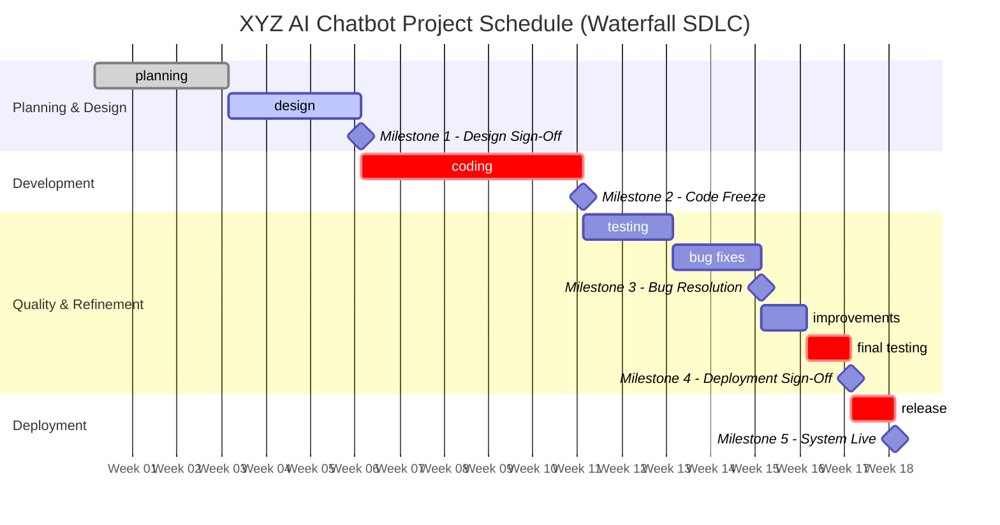

```mermaid
gantt
    title XYZ AI Chatbot Project Schedule (Waterfall SDLC)
    dateFormat  YYYY-MM-DD
    axisFormat  Week %W

    section Planning & Design
    planning       :done,    t1, 2026-01-05, 3w
    design         :active,  t2, after t1,   3w
    Milestone 1 - Design Sign-Off :milestone, m1, after t2, 0d

    section Development
    coding         :crit,    t3, after t2,   5w
    Milestone 2 - Code Freeze     :milestone, m2, after t3, 0d

    section Quality & Refinement
    testing        :         t4, after t3,   2w
    bug fixes      :         t5, after t4,   2w
    Milestone 3 - Bug Resolution  :milestone, m3, after t5, 0d
    improvements   :         t6, after t5,   1w
    final testing  :crit,    t7, after t6,   1w
    Milestone 4 - Deployment Sign-Off :milestone, m4, after t7, 0d

    section Deployment
    release        :crit,    t8, after t7,   1w
    Milestone 5 - System Live     :milestone, m5, after t8, 0d
```
